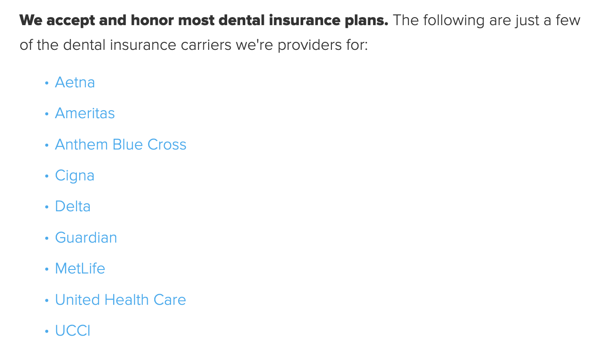
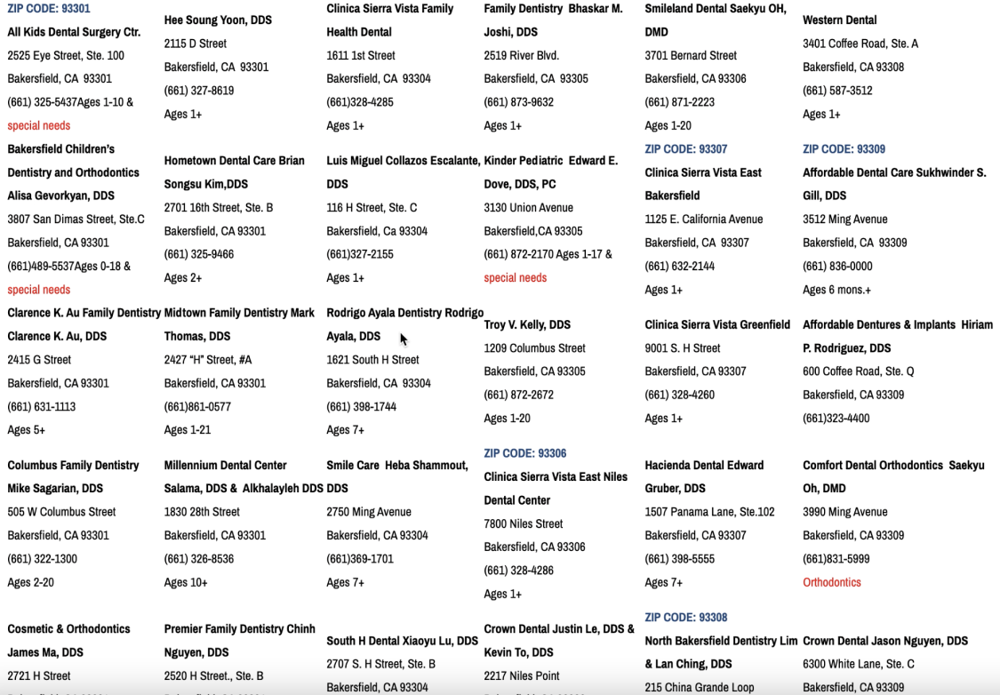
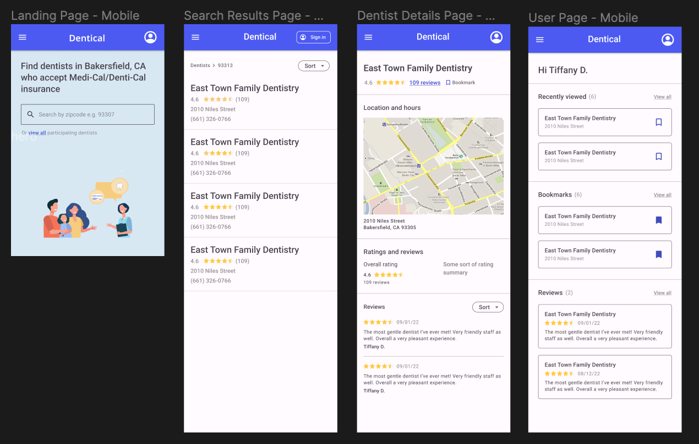

# Dentical overview
Dentical is an application that aims to help people quickly find dentists in their area who accepts Medi-Cal insurance. Currently Dentical is only serving Bakersfield, CA.

## Problem

Finding a good dentist within the Medi-Cal network can be tough. A majority of private insurances are often visibly listed on the insurance info page within a dentist's website. However, Medi-Cal insurance is rarely listed. For people who have Medi-Cal insurance, they often have to call the dentist's office or navigate through public websites that don't provide enough information.

### Unable to find Medi-Cal listed on insurance page 
- Go to any dentist's website and a user will most likely see some variation of insurance info page similar to the following image:
  
  * If you have Delta insurance, great! You know you can go to this dentist. For people with Medi-Cal insurance, they would have to call the office. Imagine how much time is spent calling, waiting, researching and Googling ratings and reviews, only to hear that unfortunately the dentist you are interested in *does not* accept your insurance. So you repeat the process however many times it takes. 

### Non user-friendly public websites
- Although there are websites available to help people look for a dentist within the Medi-Cal network, the content of the websites is usually hard to digest: 
  
  
  * At a glance, are dentists organized by zipcode from left-right or top-down? 

  * Say you want to look up a dentist on Google to see how they rate and what people are saying about them - without being extremely meticulous, it is easy to forget whom you last looked up which could lead to unnecessary repeated searches.

  * Even if you *are* meticulous - you go down the list one by one, copy-pasting each dentist's name into the search bar, check out ratings and reviews to make sure this dentist has good bedside manners - one can imagine how long this process of finding a good dentist within the Medi-Cal network can take.

## Solution
### Populate search result with all the necessary info
- In order to speed up the process of finding a dentist in the Medi-Cal network, Dentical allows users to simply input their zipcode and get back a list of dentists with info such as title, address, phone number, and **ratings and reviews** all in one place.

  
  * At a glance, users can immediately see a dentist's ratings and how many reviews they have. 

### Additional details 
- Users can click on any results to see more details about a dentist such as a map of the location and actual reviews:

  

  * On top of that, users can bookmark a dentist that they like so they can refer to it later.

### User dashboard
- Users can create an account to keep track of dentists they recently viewed, bookmarked, or reviewed *(review feature in progress)*:

  

## Summary
Dentical provides a simple, quick solution to a problem that many on Medi-Cal insurance encounter by eliminating the steps of looking up a dentist one by one. Users only have to input their zipcode to see dentists within the Medi-Cal network along with the necessary information **and** ratings and reviews. Furthermore, giving users the ability to create an account and save their data helps save time and prevent repetitive steps by indicating to users whom they have already looked up or bookmarked.

## About this project
The idea of Dentical was born after I spoke with and saw many others who struggle to find quality dental care. According to research, "one in every three Californians is dependent on Medi-Cal."1 However, healthcare providers are reimbursed so poorly by Medi-Cal that they stop seeing patients with Medi-Cal insurance.1 It takes a long time for anyone to find a dentist because dentists who accept Medi-Cal are scarce. Additionally, information on which healthcare provider accepts Medi-Cal insurance is not user-friendly or are limited. Unfortunately, even when people *are* able to find care, they often encounter unpleasant experiences.2 I built Dentical in hopes of giving people the power to quickly locate the best dentist they can under information that is easily digestible and available. 

## Technical process
### Research
- Researching the problem is a critical first step because it is important to understand what exactly needs to be solved. For this project, the problem is that finding dentists who accept Medi-Cal insurance is hard and takes a long time. This tells me that at minimum, my solution needs to help users save time and pick the best dentist they can.

### Design 
- After researching and determining what the MVP (**m**inimum **v**iable **p**roduct) should look like, a mobile-first design is drafted: 

  
  * At minimum, a user should be able to: 
    1. search by zipcode 
    2. see a list of dentists along with ratings/reviews
    3. see a more detailed page about a dentist 
    4. bookmark interested dentists

### Code 
This project uses React.js for the frontend, express.js and sode.js for the backend, and mongoDB for the database. Similar to the design, the project is built using a mobile-first approach to ensure it works across all browsers. Additionally, this project interacts with the Google Maps API to get the necessary information on dentists. 

### Repeat
After the MVP is finished, more features are added. The design/code cycle is repeated until the project is fully completed. 

### Future features
In the future, Dentical hopes to incorporate: 
- a feature that allows users to create, write, update, or delete reviews 
- a booking system that allows people to directly find **and** make an appointment with a dentist

## Closing thoughts
It is tough for both sides - healthcare providers and patients - to navigate Medi-Cal. It is unfair to blame providers for not accepting a particular insurance. It is also unfair for people who are in desperate need of care to jump through hoops to find it. Hopefully, the simplicity of Dentical can help people find care easier than before.

## Sources 
1. https://www.shastahealth.org/californians-medi-cal-face-hurdles-see-specialists-throughout-state
2. https://www.calhealthreport.org/2018/08/16/thousands-medi-cal-patients-report-poor-treatment-doctors-staff/